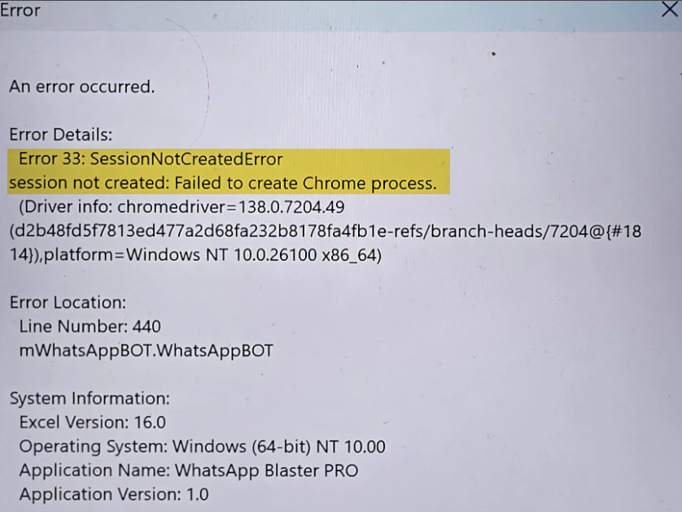

# How to send media or documents with a caption

With WhatsApp Blaster, you can send media files (images, PDFs, etc.) along with a caption in one message. Just enter the file path and add your text in the caption field.

### How to do it

1. **Enter the file path** in the `Text` column (e.g., `C:\Users\codin\Desktop\course.pdf`).
2. **Set the Type** as `Document` or `Media`.
3. **Add a caption** in the `Media/Document Caption` column. You can use placeholders (`{{customer_name}}`), emojis, and text.
   * Example: `Hi {{customer_name}}, here’s the file you requested 📁`

### Example

<figure><figcaption>
Send media or documents with a caption 
</figcaption></figure>

