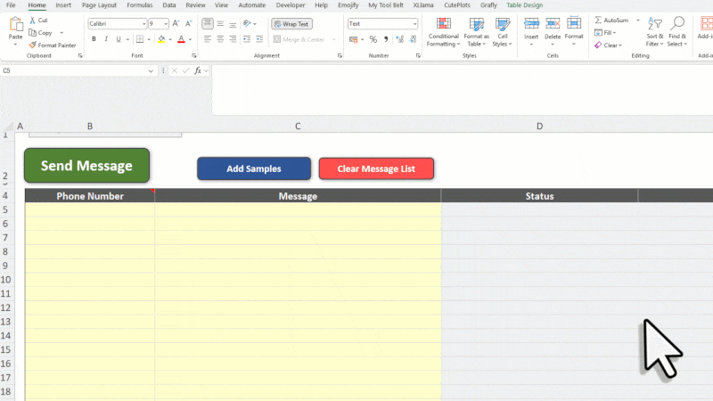

# Message gets split into multiple cells when pasting

If you copy a message from WhatsApp and paste it into Excel, Excel might split it across multiple rows or cells. This happens because Excel treats each line break as a new row.

**✅ How to fix it**

**Paste the message into the formula bar** instead of directly into the cell. That way, the entire message stays in one cell, including the line breaks.

<figure><figcaption></figcaption></figure>
